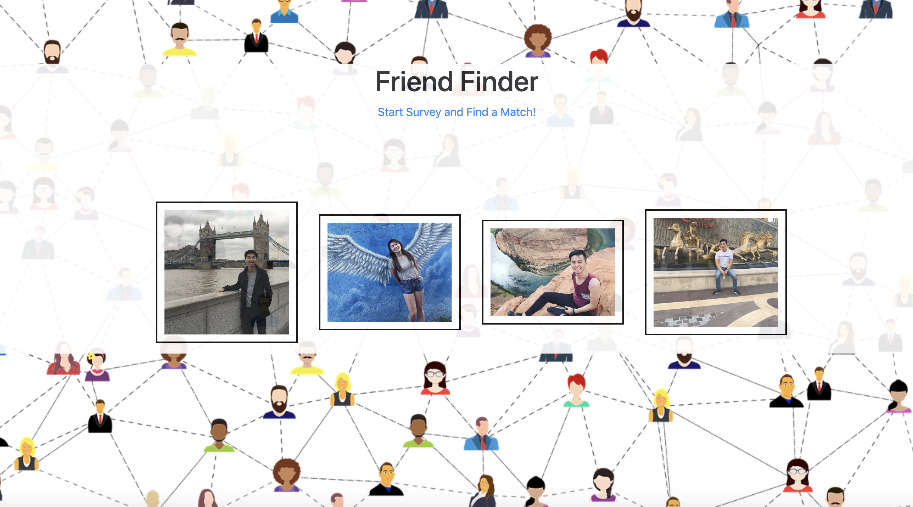
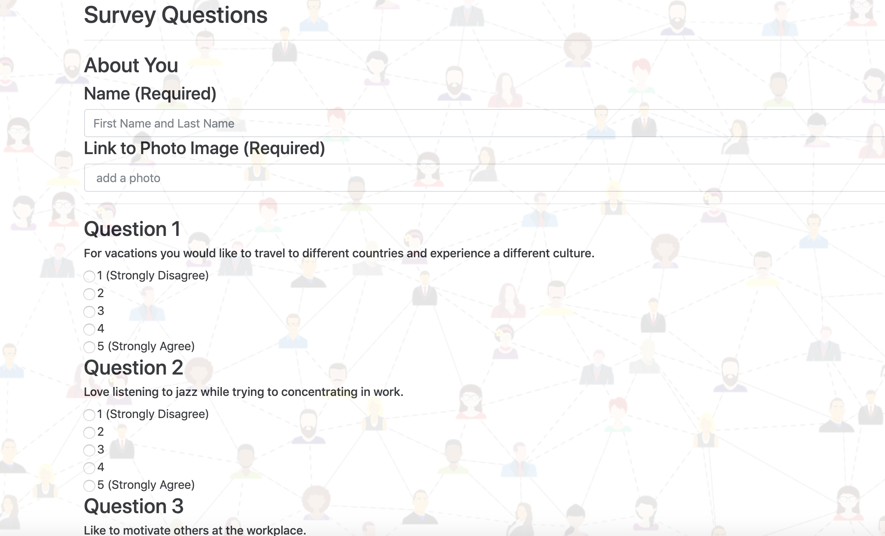
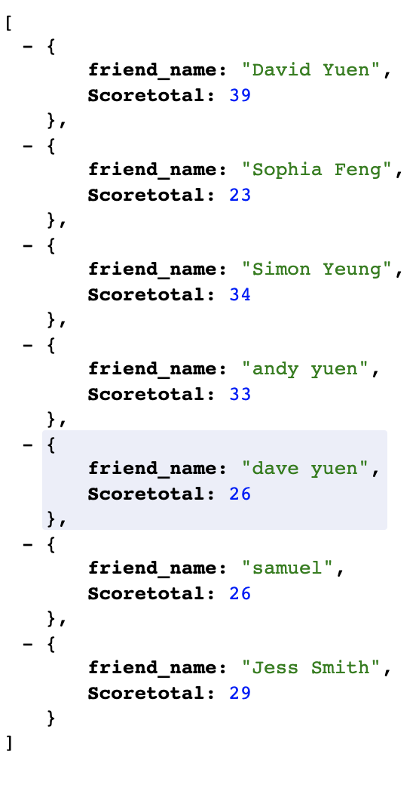

# friendFinder

<h2><strong> Instructions </strong></h2> 

Similar to dating apps that has the user answering questions and matching them with others that scored the same. Once the user has answered all the questions, their scores will be added up and matched with others that scored similar. 

First page displays some of the images of the users.
 
 

When the app is started. The survey page will be displayed for the user so that the user can answer the questions. The questions are scored from 1-5 which once submitted would then be added up and compared to other users.
 

 
Using MySQL to query and get the total score from each user and display them as JSON format.
 

This app was created with express, path, body-parser, mysql for the database, HTTP methods, html, css, node.js, javascript and jquery. 

